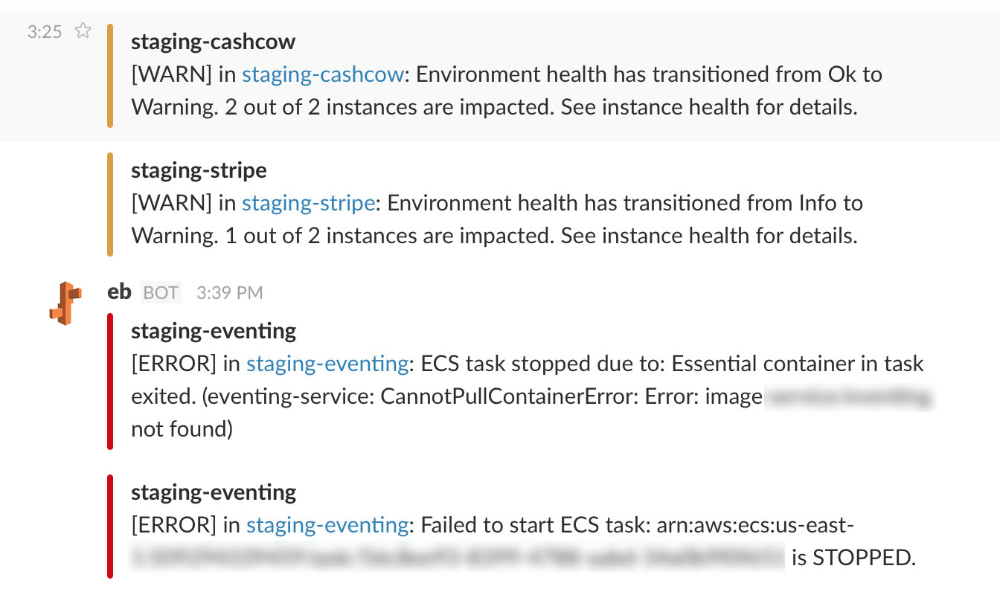

# eb-notifications

AWS Lambda function for Elastic Beanstalk notifications. Runs every minute, gets recent EB events and forwards them to Slack and/or PagerDuty.

## Rules

- All events with WARN, ERROR and FATAL severity are forwarded to Slack
- All events with ERROR and FATAL severity are forwarded to PagerDuty

## To install and run locally

Add `exports.handler();` to the bottom of the `index.js` file, so you can run it. AWS Lambda doesn't need it.

```
npm install
npm start
```

## To setup in AWS

Copy-paste `index.js` to Node.js function in AWS Lambda, hit Save.

### Notes

Currently AWS Lambda Node environment doesn't support ES6 `import`.

## Results in Slack

